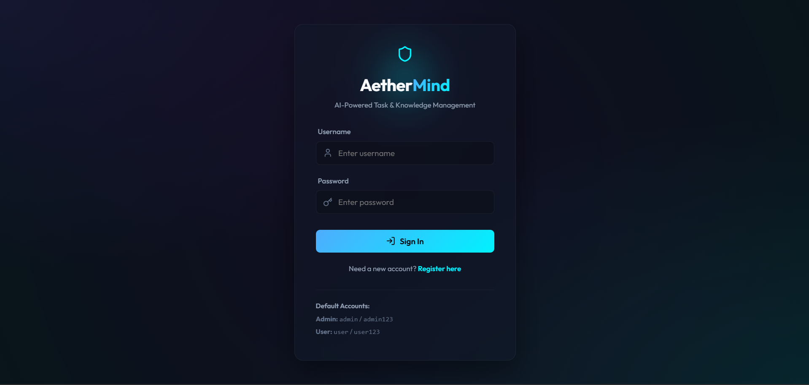
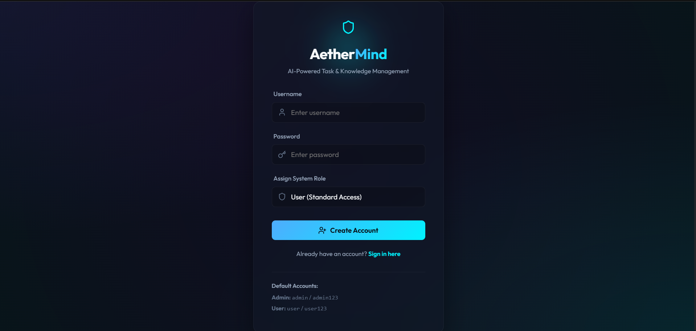
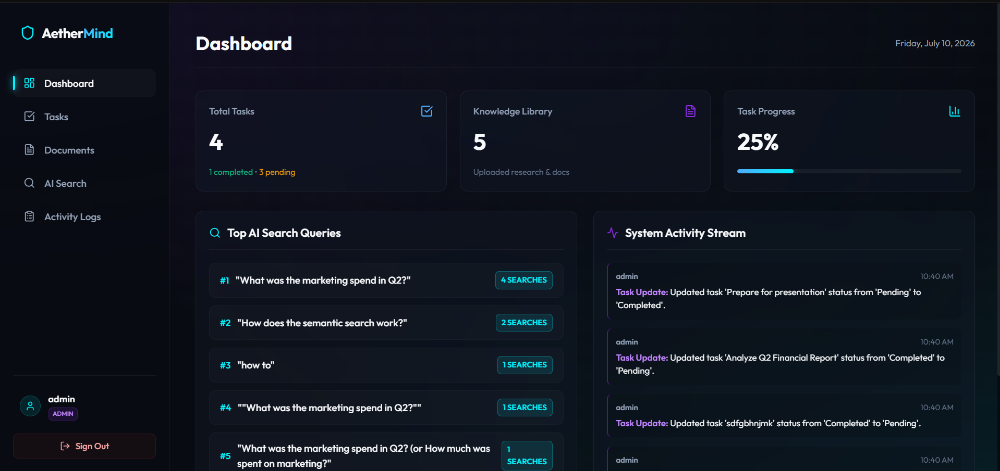
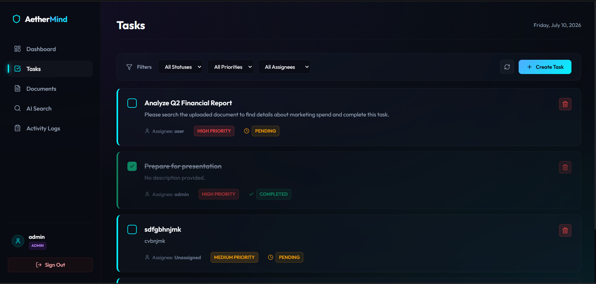
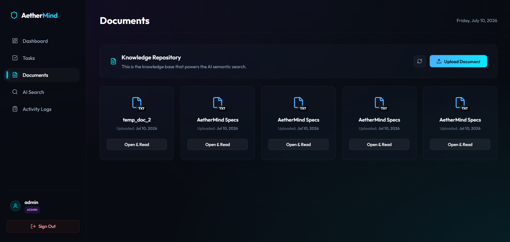
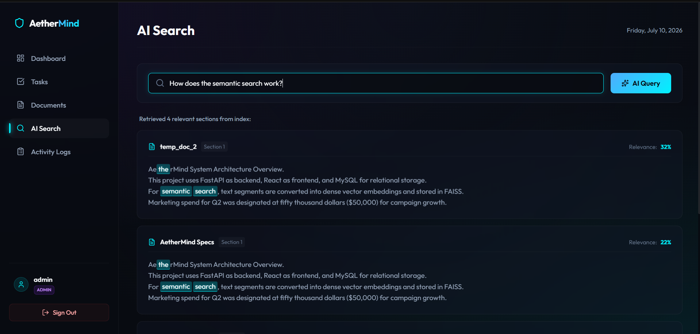
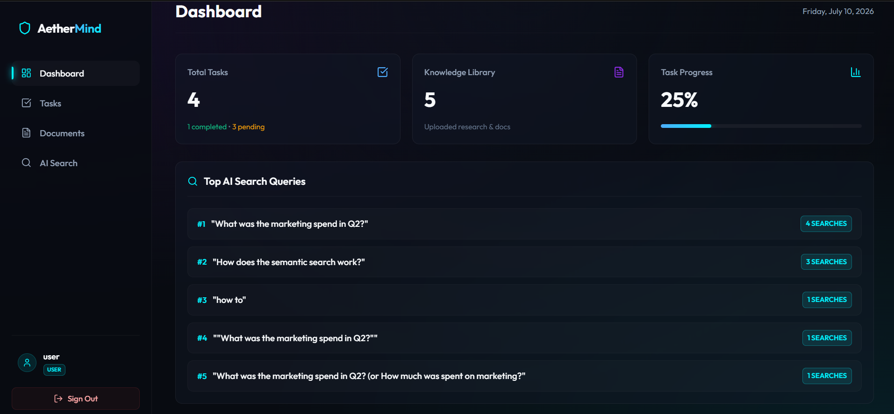
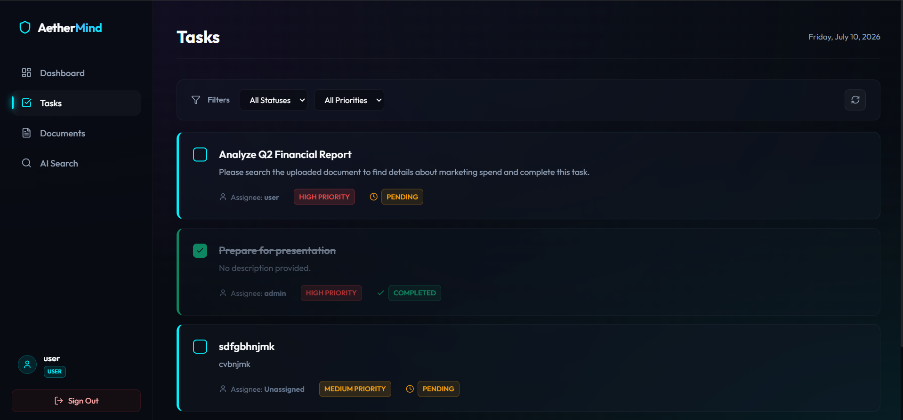

# 🚀 AetherMind - AI-Powered Task & Knowledge Management System

AetherMind is an AI-powered Task & Knowledge Management System that enables organizations to efficiently manage tasks and knowledge documents. The system provides secure role-based access, document management, AI-powered semantic search, task assignment, and analytics through an intuitive web interface.

---

# 📌 Features

## 🔐 Authentication
- JWT Authentication
- Role-Based Access Control (RBAC)
- Secure Password Hashing
- User Registration & Login

## 👨‍💼 Admin Features
- Dashboard Analytics
- Upload PDF/TXT Documents
- Create & Assign Tasks
- Manage Users
- Activity Logs
- AI Semantic Search

## 👤 User Features
- View Assigned Tasks
- Update Task Status
- AI Document Search
- Personal Dashboard

## 🤖 AI Features
- Semantic Search
- Dense Vector Embeddings
- FAISS Vector Index
- TF-IDF Fallback Search
- Document Chunking

---

# 🛠 Tech Stack

| Category | Technology |
|-----------|------------|
| Frontend | React.js, Vite, JavaScript, CSS |
| Backend | FastAPI, Python |
| Database | MySQL 8.0 |
| ORM | SQLAlchemy |
| Authentication | JWT |
| Validation | Pydantic |
| AI Model | Sentence Transformers |
| Vector Database | FAISS |
| Version Control | Git & GitHub |

---

# 📂 Project Structure

```
AI-Powered-Task-Knowledge-Management-System
│
├── backend
│   ├── app
│   │   ├── routers
│   │   ├── services
│   │   ├── auth.py
│   │   ├── config.py
│   │   ├── database.py
│   │   ├── models.py
│   │   ├── schemas.py
│   │   └── main.py
│   │
│   ├── uploads
│   ├── requirements.txt
│   ├── seed.py
│   ├── test_api.py
│   └── .env
│
├── frontend
│   ├── src
│   ├── package.json
│   └── vite.config.js
│
├── docs
│   └── screenshots
│
└── README.md
```

---

# ⚙️ Setup Instructions

## Step 1: Clone Repository

```bash
git clone https://github.com/SuprithKumarBL20/AI-Powered-Task-Knowledge-Management-System.git

cd AI-Powered-Task-Knowledge-Management-System
```

---

## Step 2: Configure Environment Variables

Open

```
backend/.env
```

Update your MySQL credentials.

```env
DB_USER=root
DB_PASSWORD=******
DB_HOST=127.0.0.1
DB_PORT=3306
DB_NAME=task_knowledge_db

JWT_SECRET=your_secret_key

ACCESS_TOKEN_EXPIRE_MINUTES=600

UPLOADS_DIR=uploads

FAISS_INDEX_PATH=faiss_index
```

---

## Step 3: Install Backend Dependencies

```bash
cd backend

pip install -r requirements.txt
```

---

## Step 4: Initialize Database

```bash
python seed.py
```

This script will

- Create Database
- Create Tables
- Seed Roles
- Seed Default Users

---

## Step 5: Run Backend

```bash
uvicorn app.main:app --reload --host 127.0.0.1 --port 8080
```

Backend API

```
http://127.0.0.1:8080
```

Swagger Documentation

```
http://127.0.0.1:8080/docs
```

---

## Step 6: Run Frontend

Open another terminal.

```bash
cd frontend

npm install

npm run dev
```

Frontend URL

```
http://localhost:5173
```

---

# 🔑 Default Credentials

## Administrator

| Username | Password |
|----------|----------|
| admin | admin123 |

## Standard User

| Username | Password |
|----------|----------|
| user | user123 |

---

# 🧪 Testing

Run the integration tests.

```bash
cd backend

python test_api.py
```

---

# 🔒 Authentication Workflow

```
User Login
      │
      ▼
JWT Token Generated
      │
      ▼
Stored in Browser Local Storage
      │
      ▼
Authorization: Bearer <JWT>
      │
      ▼
Protected API Access
```

---

# 🤖 AI Search Workflow

```
Upload PDF / TXT
        │
        ▼
Document Parsing
        │
        ▼
Document Chunking
        │
        ▼
Sentence Embeddings
        │
        ▼
FAISS Vector Index
        │
        ▼
Semantic Search
        │
        ▼
Relevant Results
```

---

# 📊 Database Tables

- Roles
- Users
- Tasks
- Documents
- Activity Logs

The application uses SQLAlchemy ORM with proper Primary Key and Foreign Key relationships.

---

# 📸 Output Screenshots

## Login Page

JWT-based secure login page.



---

## User Registration

Register a new account.



---

## Admin Dashboard

Displays analytics and system overview.



---

## Task Management

Admin can create and assign tasks.



---

## Document Management

Upload and manage PDF/TXT documents.



---

## AI Semantic Search

Search uploaded documents using AI.



---

## Activity Logs

Monitor user activities and system operations.

.png)

---

## User Dashboard

Overview of assigned tasks.



---

## User Tasks

View and update assigned tasks.



---


# 🚀 Future Enhancements

- Docker Support
- Email Notifications
- OCR for Scanned PDFs
- Elasticsearch Integration
- Cloud Storage Support
- User Profile Management
- Advanced Analytics Dashboard

---

# 👨‍💻 Author

**Suprith Kumar B L**

Bachelor of Engineering (Computer Science & Engineering)

GitHub: https://github.com/SuprithKumarBL20

---

# 📄 License

This project was developed as part of a technical assignment and is intended for educational and demonstration purposes.
